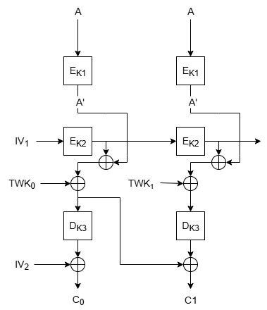

# Triple-Flavor [_snakeCtf 2025 Quals_]

**Category**: Crypto

## Description

Why settle for just one mode of operation when you can have 3?

## Solution

The challenge presents a server with an encryption function that uses AES with 3 different modes of operation concatenated together: ECB and OFB in encryption mode and CBC in decryption mode. It can be observed that the server generates the keys for the different mode in a vulnerable way: a secret token made up of lowercase letters and digits is randomly created and split in 3 substrings of 5 characters each; these substrings are then hashed using SHA256; the 3 digests are then truncated to 16 bytes and used as keys for the respective ciphers.

The server returns the ciphertext corresponding to a plaintext submitted by the user and then asks for a guess of the secret token. If the guess is correct the server returns the flag.

To retrieve the second and the third parts of the secret token the [AAA-attack](https://iacr.org/archive/asiacrypt2001/22480210.pdf) can be carried out.
The following image presents a scheme of the encryption process for two equal plaintext blocks.

From this it can be seen that the following equalities hold
$$
C_0 = IV_2 \oplus D_{K3}(A' \oplus E_{K2}(IV_1) \oplus TWK_0)\\
C_1 = A' \oplus E_{K2}(IV_1) \oplus TWK_0 \oplus D_{K3}(A' \oplus E_{K2}(E_{K2}(IV_1)) \oplus TWK_1)
$$

The first one can be rewritten in the following way
$$
C_0 \oplus IV_2 = D_{K3}(A' \oplus E_{K2}(IV_1) \oplus TWK_0)\\
E_{K3}(C_0 \oplus IV_2) = A' \oplus E_{K2}(IV_1) \oplus TWK_0
$$

And then it is possible to XOR it with the expression for $C_1$ to eliminate the outer $A'$

$$
C_1 \oplus E_{K3}(C_0 \oplus IV_2) = D_{K3}(A' \oplus E_{K2}(E_{K2}(IV_1)) \oplus TWK_1)
$$

Finally, by encrypting both sides with key $K_3$ and XOR-ing with the expression for $E_{K3}(C_1 \oplus IV_2)$ it is possible to get the following expression

$$
E_{K3}(C_1 \oplus E_{K3}(C_0 \oplus IV_2)) \oplus E_{K3}(C_0 \oplus IV_2) \oplus TWK_0 \oplus TWK_1 = E_{K2}(IV_1) \oplus E_{K2}(E_{K2}(IV_1))
$$

As it can be seen this expression depends only on information provided to the user: the ciphertext blocks, the ivs and the tweaks (which can be computed from the $IV_2$). Therefore this can be used as the condition to test for a meet-in-the-middle attack to recover the second and the third parts of the secret token and, in turn the keys $K_2$ and $K_3$. Once these are known, the last two layers of the encryption process can be reversed to get the intermediate ciphertext $A'$ and use it to bruteforce the last part of the secret token.