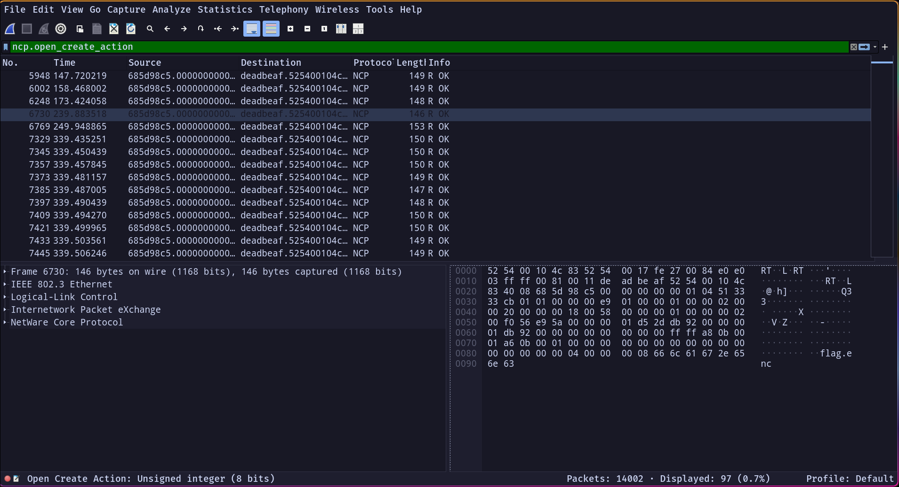
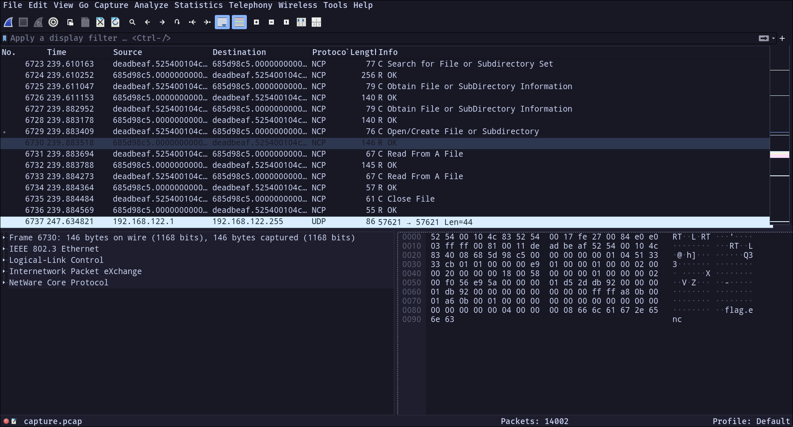

# NCPunk'd [_snakeCTF 2025 Quals_]

**Category**: misc
**Author**: lilvirgola

## Description

Who the hell uses IPX and NCP in 2025? This guy. Can you help me find the flag?

## Solution

### Inspecting the captured traffic
Opening the provided .pcap file in Wireshark and checking the protocol hierarchy reveals that the majority of traffic is not the usual TCP/IP, but rather IPX packets, with a significant portion using the NetWare Core Protocol (NCP).

### What is NCP?
The NetWare Core Protocol (NCP) is a network protocol developed by Novell for use with its NetWare operating system, originally targeting MS-DOS clients. Over time, support expanded to include Windows, classic Mac OS, Linux, and various Unix systems.

NCP handles a wide range of services, including file and printer access, directory operations, clock sync, messaging, and remote command execution. It was initially built on top of the IPX/SPX protocol stack due to its simplicity and low memory footprint, but a TCP/IP-based implementation has also been available since the early 1990s.

### Analyzing the Traffic
Given the protocol hierarchy and challenge title, it can be assumed that the goal involves inspecting NCP requests, particularly those performing file operations. Filtering by the ncp.open_create_action field helps isolate packets related to opening or creating files:
`ncp.open_create_action`

Two packet immediately stands out: one references a file named flag.enc the other a file named admin_diary.txt.

### Extracting file from the .pcap
After identifying the Open/Create action, the traffic includes three key operations:
   - Open/Create file 
   - Read from file
   - Close file

The relevant data is located in the responses to the "Read from file" operations. Since Wireshark does not natively support file extraction from NCP, a custom script can be used to automate this process:
[ncp_extract.py](attachments/ncp_extract.py)
Upon extraction, two files are recovered: the flag file (encrypted) and a note hinting that the encryption program is custom and is stored in the server.

### Finding the encryption program
Using the same approach as before, another file named encrypt.pyc is discovered in the traffic. After extracting it with the same tool, the bytecode can be decompiled using a .pyc decompiler such as decompyle3.
Here there is a briefly commented decompiled version
[encrypt_decompiled.py](attachments/encrypt_decompiled.py)

### Reverse the python code
The encryption logic involves six distinct steps:
   - A simple Caesar cipher shifting each character by +1.
   - Reversing the string obtained from stage1
   - A multi-byte XOR with a fixed key.
   - A matrix transformation that rotates bytes within a 4×4 grid.
   - A final XOR using a pseudo-random number generator with the formula x = (x * a + c) % m.
   - Base64 Encoding of the result
The PRNG seed is computed as: 
`seed = length * 1337 + ord(first_char) * 42`
To decrypt the flag, both the length and the first character must be guessed or brute-forced.
[decrypt.py](attachments/decrypt.py)

### Solving
The full exploit and solve flow is implemented in the following script using the decryption method found:
[solve.py](attachments/solve.py)
