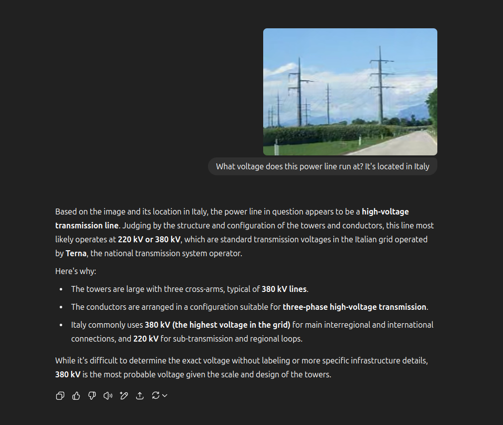
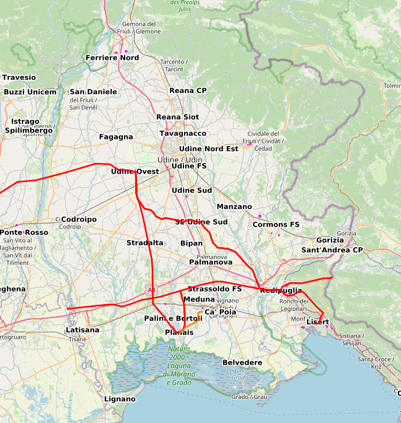

# GeoGuessitFVG [_snakeCTF 2025 Quals_]

**Category**: misc

## Description

Geoguess it. It's easy. It's in the FVG special administrative region.

Our friend got lost while driving back home with his snake friends. He recorded this video and then stopped the car shortly after ending the recording. Can you help us locate him now?

## Solution

Challenge is a dashcam video of a car driving on a rural road somewhere in the FVG autonomous administrative region of Italy.  
A power transmission line is visible in the video.

If you are a nerd of power distribution networks you can clearly see that the line in the video is a 380kV line, constructed within the last 20 years.  
If you are not familiar with power distribution networks take a frame and send it to your favorite LLM.

We have now confirmed that we are looking at a 380kV power transmission line, in the FVG autonomous administrative region of Italy.

Looking further we can see that there are two power lines running one parallel to the other.  
We are now looking for a set of two parallel 380kV lines, in the FVG autonomous administrative region of Italy.

A quick DuckDuckGo search for "linee elettriche fvg mappa" (power lines fvg map), yields:
[Linee Elettriche](https://www.arpa.fvg.it/temi/temi/campi-elettromagnetici/sezioni-principali/linee-elettriche/#open-modal-elettrodotti)  
Same result is obtained by querying "mappa linee elettriche italia" (3rd result on DuckDuckGo) or "mappa 380kv fvg" (2nd result on DuckDuckGo).  
Let's select "380kv" on the map.
We can see that there are only two areas where we find two 380kV lines running in parallel, one leaving the Redipuglia primary substation, and one leaving the Udine west primary substation. Our place is located somewhere along these two lines.

Matching the map with data from Google Street View we see that both lines use the exact same pylon design. We see however that the line connecting the Redipuglia primary substation is near an airport and has aerial marker balls attached to the topmost guard wire. As marker balls are not present in the video we can establish that we are looking at the line connecting the Udine west primary substation, before the two lines separate.

Let's take all intersections between a road and the transmission line. 10 results are found. 4 can be trivially excluded by looking at the satellite image. 6 are brute forced by using Google Street View to find the correct one.

Challenge can also be solved using entirely data from OSM, although not as quickly.
